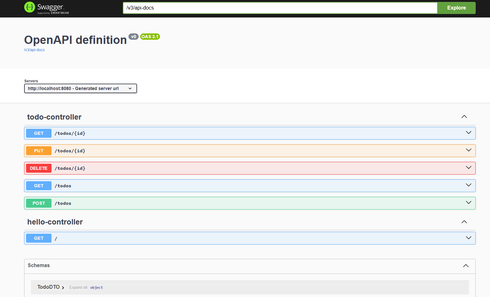

# Java Todo API

This project is a Todo API built using Java 23, Spring Boot, and SQLite, following the Clean Architecture principles and implementing the CQRS pattern.

## Project Structure

```
java-todo-api
├── .gitignore
├── .idea
│   ├── .gitignore
│   ├── compiler.xml
│   ├── encodings.xml
│   ├── httpRequests
│   ├── jarRepositories.xml
│   ├── libraries
│   ├── misc.xml
│   ├── vcs.xml
│   └── workspace.xml
├── .qodo
├── api-client.http
├── lib
│   ├── angus-activation-2.0.0.jar
│   ├── antlr4-runtime-4.13.0.jar
│   ├── apiguardian-api-1.1.2.jar
│   ├── byte-buddy-1.14.15.jar
│   ├── byte-buddy-1.15.0.jar
│   ├── byte-buddy-agent-1.14.15.jar
│   ├── byte-buddy-agent-1.15.0.jar
│   ├── classmate-1.5.1.jar
│   ├── hamcrest-core-1.3.jar
│   ├── hibernate-commons-annotations-6.0.6.Final.jar
│   └── ...
├── pom.xml
├── README.md
├── src
│   ├── main
│   │   ├── java
│   │   │   └── com
│   │   │       └── example
│   │   │           ├── application
│   │   │           │   ├── dto
│   │   │           │   │   └── TodoDTO.java
│   │   │           │   ├── interfaces
│   │   │           │   │   ├── TodoRepository.java
│   │   │           │   │   └── UserRepository.java
│   │   │           │   ├── usecase
│   │   │           │   │   ├── CreateTodoCommandHandler.java
│   │   │           │   │   ├── DeleteTodoCommandHandler.java
│   │   │           │   │   ├── GetAllTodosQueryHandler.java
│   │   │           │   │   ├── GetTodoByIdQueryHandler.java
│   │   │           │   │   └── UpdateTodoCommandHandler.java
│   │   │           │   └── TodoService.java
│   │   │           ├── domain
│   │   │           │   ├── command
│   │   │           │   │   ├── CreateTodoCommand.java
│   │   │           │   │   ├── DeleteTodoCommand.java
│   │   │           │   │   └── UpdateTodoCommand.java
│   │   │           │   ├── model
│   │   │           │   │   └── Todo.java
│   │   │           │   └── query
│   │   │           │       ├── GetAllTodosQuery.java
│   │   │           │       └── GetTodoByIdQuery.java
│   │   │           ├── presentation
│   │   │           │   └── controller
│   │   │           │       ├── HelloController.java
│   │   │           │       └── TodoController.java
│   │   │           └── App.java
│   │   └── resources
│   │       ├── application.properties
│   │       └── schema.sql
│   └── test
│       └── java
│           └── com
│               └── example
│                   ├── application
│                   │   ├── dto
│                   │   │   └── TodoDTOTest.java
│                   │   ├── service
│                   │   │   └── TodoServiceTest.java
│                   │   └── usecase
│                   │       ├── command
│                   │       │   ├── CreateTodoCommandHandlerTest.java
│                   │       │   ├── DeleteTodoCommandHandlerTest.java
│                   │       │   └── UpdateTodoCommandHandlerTest.java
│                   │       └── query
│                   │           ├── GetAllTodosQueryHandlerTest.java
│                   │           └── GetTodoByIdQueryHandlerTest.java
│                   ├── integration
│                   │   ├── TodoController1IntegrationTest.java
│                   │   ├── TodoControllerIntegrationTest.java
│                   │   └── TodoServiceIntegrationTest.java
│                   └── presentation
│                       └── controller
│                           ├── TodoController2Test.java
│                           └── TodoControllerTest.java
├── target
│   ├── classes
│   ├── generated-sources
│   ├── generated-test-sources
│   ├── maven-archiver
│   ├── maven-status
│   ├── surefire-reports
│   └── test-classes
└── ...
```

## Features

- Create, retrieve, update, and delete todos.
- Uses SQLite for data persistence.
- Follows Clean Architecture principles for better separation of concerns.
- Implements CQRS for handling commands and queries separately.

## Setup Instructions

1. Clone the repository:
   ```
   git clone <repository-url>
   cd todo-api
   ```

2. Build the project using Maven:
   ```
   mvn clean install
   or
   mvn dependency:purge-local-repository -DreResolve=true
   ```

3. Run the application:
   ```
   mvn spring-boot:run
   or
   mvn org.springframework.boot:spring-boot-maven-plugin:run
   ```

4. Access the API at `http://localhost:8080/todos`.

5. Access Swagger UI for API documentation and testing at `http://localhost:8080/swagger-ui/index.html`.

## Setting Up the Database

To set up the SQLite database and create the necessary tables, you can use the provided `schema.sql` script. Follow these steps:

1. Ensure you have SQLite installed on your machine. You can download it from [SQLite Download Page](https://www.sqlite.org/download.html).

2. Navigate to the `src/main/resources` directory where the `schema.sql` file is located.

3. Run the following command to create the database and tables:

   ```sh
   # cmd
   sqlite3 todo.db < schema.sql

   # ps
   Get-Content schema.sql | sqlite3 todo.db
   ```

This command will create a `todo.db` SQLite database file and execute the SQL statements in the `schema.sql` file to create the necessary tables.

## Swagger UI



## Usage

- **Create a Todo**: Send a POST request to `/todos` with a JSON body containing `title`.
- **Get All Todos**: Send a GET request to `/todos`.
- **Get a Todo by ID**: Send a GET request to `/todos/{id}`.
- **Update a Todo**: Send a PUT request to `/todos/{id}` with the updated JSON body.
- **Delete a Todo**: Send a DELETE request to `/todos/{id}`.

## License

This project is licensed under the MIT License. See the LICENSE file for details.